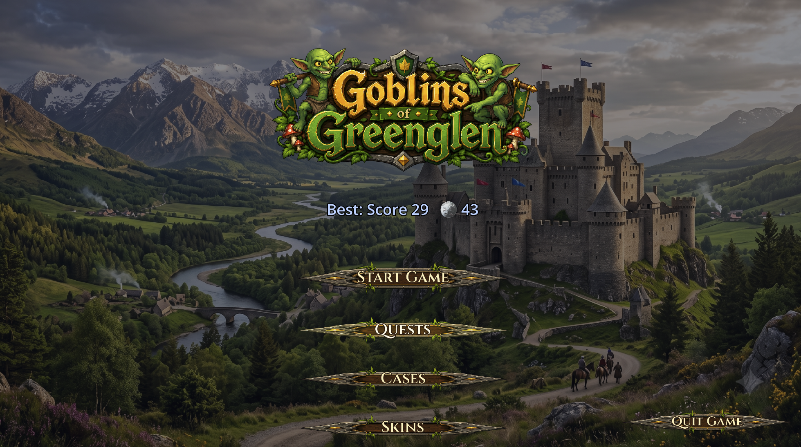
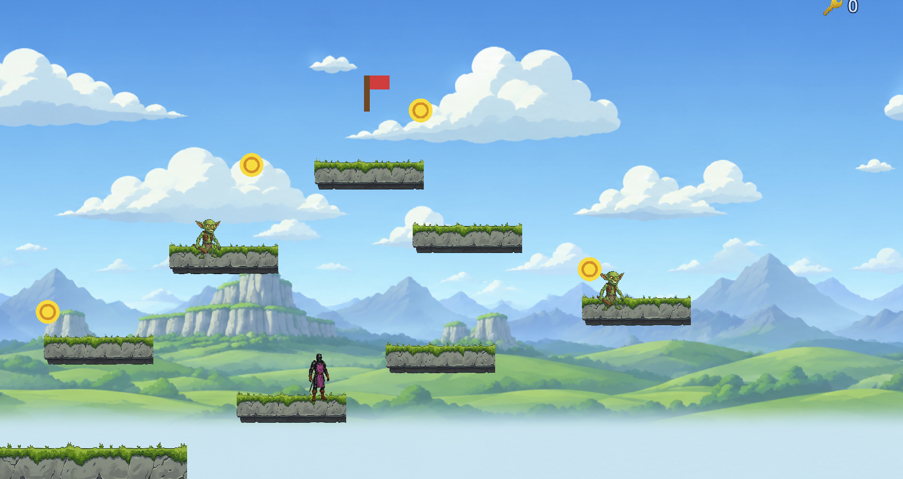

# Goblins of Greenglen

> GitHub repository: `GoblinsOfGreenglen`. The local checkout folder may use any name; "Goblins of Greenglen" is the in-game display name.

A 2D side-scrolling platformer built with **Godot 4.6** and pure **GDScript**. Play as a knight, stomp goblins, collect coins, and reach the red flag across 6 increasingly challenging levels — including two horizontally scrolling stages and a final level with randomized enemy/coin placement.

**Status:** Fully playable end to end — all 6 levels, combat, coins, and a shared run-result flow ("Run Complete" / "Run Over") work as intended. The campaign world map is now an active main-menu submenu: browse regions, replay unlocked levels individually, and preview upcoming content. The generated chiptune soundtrack and SFX add a fun, goofy charm to the whole thing.

---

## Gameplay

- **6 levels** of increasing difficulty — Levels 4–5 scroll horizontally, Level 6 randomizes enemy/coin placement on every playthrough
- **Stomp enemies** by landing clearly on top while descending; upward and side contacts deal damage
- **Collect coins** scattered across each level
- **Reach the red flag** to advance to the next level
- **3 hearts** of health — taking damage or falling off the world costs a heart and reduces your score
- **Shared Greenglen result menu** for both run outcomes — "Run Complete" after Level 6, "Run Over" on a fatal hit or fall. Both show score, coins, and your best completed run; only a qualifying completed run adds "New Highscore!". Run Again and Main Menu buttons (or `R`) continue from either outcome
- **World map (Map button)** — a campaign map submenu on the main menu: pick any unlocked level and play it individually, see per-level best records and region progress, and preview locked or upcoming locations (view only). A region status banner explains each region's availability — Available, Locked (naming the previous region's outstanding main levels and core trials), or Coming Soon once its prerequisites are met. The map reopens on your last selection; Start Game still runs the classic six-level gauntlet

---

## Controls

| Action | Keys |
|---|---|
| Move left / right | Arrow keys or `A` / `D` |
| Jump | `Space` or `Arrow Up` |
| Double jump | Press `Space` / `Arrow Up` again in mid-air |
| Pause | `Escape` |
| Restart / Retry | `R` |

---

## Screenshots

### Main Menu



### Gameplay



---

## Requirements

- [Godot Engine 4.6](https://godotengine.org/download) (standard build, no .NET required)

---

## How to Run

1. Clone this repository:
   ```bash
   git clone https://github.com/Knolli3D/GoblinsOfGreenglen.git
   ```
2. Open Godot 4.6 and choose **Import Project**
3. Select the `project.godot` file in the cloned folder
4. Press **F5** (Run Project) or click the Play button

No external plugins or dependencies required.

---

## Testing

The project ships a dependency-free headless test harness (plain GDScript, no external framework). It requires **Godot 4.6**. One command runs the complete suite:

```bash
/Applications/Godot.app/Contents/MacOS/Godot --headless --path . -s res://tests/run_all.gd
```

- **Exit codes:** `0` when every check passes *and* the save-isolation canary is intact; any failing check (or canary violation) returns `1`.
- **Coverage:** three suites run as isolated child processes — save validation/upgrade/recovery (83 checks), campaign catalog/progression behavior (68 checks), and scene/behavior smoke coverage (247 checks: component ownership/wiring, the campaign map submenu (single Greenglen Map button, 960×540 layout fit, real button/intent flow, exclusive visibility, back navigation, selection restore, launch/lock/unreleased guards, repeated open-close stability), menu interactions and case/skin flow, all scenes and levels, resources, run-result lifecycle, transition cancellation). **398 checks total.**
- **Deterministic:** all randomness is seeded and no assertion depends on frame rate; repeated runs produce identical results.
- **Verified save isolation:** every suite redirects all save I/O into a fresh temporary directory *before* the game's autoload starts (save migration included), and the runner hash-verifies your real `highscore.cfg`, `progression.cfg`, and `campaign.cfg` files (plus `.bak` backups) before and after the run. Temporary files are cleaned up on success.

---

## Project Structure

```
GoblinsOfGreenglen/
├── scripts/
│   ├── Game.gd          # Run coordinator: gameplay state, level lifecycle, signals, transitions
│   ├── CampaignCatalog.gd      # Validated stable region, level, trial, and route definitions
│   ├── CampaignProgressStore.gd # Versioned unlocks, completions, records, and milestones
│   ├── CampaignMapController.gd # Campaign map submenu (Map button) and selection intents
│   ├── CampaignMapPathLayer.gd # Required/optional route rendering and lock states
│   ├── AudioController.gd     # Music, SFX voice pool, and pause ducking
│   ├── HUDController.gd       # HUD snapshots, transient messages, and POW! feedback
│   ├── GameMenuController.gd  # Main, pause, and shared run-result presentation
│   ├── QuestMenuController.gd # Daily/weekly quest rendering and claims
│   ├── CaseMenuController.gd  # Case reel, spin state, and rarity reveals
│   ├── SkinMenuController.gd  # Skin list, preview, and equip UI
│   ├── HighscoreStore.gd      # Versioned local best-run persistence and comparison
│   ├── GreenglenUI.gd         # Shared theme, fonts, and submenu construction helpers
│   ├── Progression.gd   # Autoload singleton: daily/weekly quests, keys, case opening, skin inventory
│   ├── Player.gd        # CharacterBody2D: movement, double-jump, swept stomp detection, signals, skins
│   ├── Enemy.gd         # CharacterBody2D: patrol AI, previous position tracking, kill logic
│   ├── Coin.gd          # Area2D: coin pickup
│   ├── Goal.gd          # Area2D: level exit flag
│   ├── Platform.gd      # StaticBody2D: sprite scaling from collision shape
│   ├── Level.gd         # Node2D base: parallax background, optional randomized spawns
│   ├── SaveMigration.gd # One-time save migration from the pre-rename "Cloude Game" user dir
│   └── SaveData.gd      # Versioned save helpers: typed reads, [meta] schema version, .bak backup/recovery
├── tests/
│   ├── run_all.gd           # Headless test runner: all three suites + save-isolation canary
│   ├── test_save_system.gd  # Save validation, schema upgrade, and recovery suite
│   ├── test_campaign_progress.gd # Catalog, unlock, record, trial, and persistence suite
│   ├── test_smoke.gd        # Scene, resource, run-result, and transition-lifecycle suite
│   └── test_env.gd          # Test isolation helper (redirects save I/O to a temp dir)
├── scenes/
│   ├── Main.tscn       # Entry point: Game coordinator plus explicit controller/service children
│   ├── Player.tscn / Enemy.tscn / Coin.tscn / Goal.tscn / Platform.tscn
│   ├── Level1–3.tscn   # Hand-placed levels
│   ├── Level4.tscn     # Horizontal scrolling (1920 px wide)
│   ├── Level5.tscn     # Wide scrolling (2560 px wide)
│   └── Level6.tscn     # Finale: randomized enemy/coin spawns each play
├── assets/
│   ├── sprite_knight.png / sprite_goblin.png / sprite_platform.png
│   ├── sprite_knight_*.png     # Skin art: gold, emerald, pink, blood, black
│   ├── sprite_princess_*.png   # Legendary skin art: blue (starter), gold, green, purple, red
│   ├── level_bg.png / level_bg_near.png   # Level parallax background art
│   ├── menubackground.png / menu_bg_quests.png / menu_bg_cases.png / menu_bg_skins.png  # Menu backgrounds
│   ├── LOGO_menu_GoGg.png / icon_GoGg.png  # Main-menu logo and app/window icon
│   ├── ui/buttons/button_greenglen_*.png   # Nine-patch button art (normal/hover/pressed/disabled)
│   ├── screenshots/              # Main-menu and gameplay images used in this README
│   └── audio/                  # Generated chiptune SFX + looping music
└── Cinzel/              # Cinzel font family (SIL OFL) used for all UI text
```

> Skin sprites (`sprite_knight_*`, `sprite_princess_*`) must have transparent backgrounds; sprites delivered with a white background are cut out before use, or they show as a white box in-game.

---

## Architecture

The game uses a **signal-based, scene-driven** architecture, mostly avoiding singletons:

- **`Game.gd`** is the run coordinator added to the `"game"` group. It remains the sole owner of gameplay state and lifecycle decisions: active stable level ID, level loading, player signal wiring, health, score, coins, invulnerability, transitions, and run outcomes.
- **Controller and service nodes declared in `Main.tscn`** own focused concerns: audio, HUD/feedback, main/pause/result menus, quests, cases, skins, highscores, campaign progress, and the hidden campaign map shell. Menu actions are sent back to `Game.gd` as intent signals; UI controllers do not keep competing copies of run state.
- **`CampaignCatalog.gd`** is the source of truth for stable region/level IDs, scene paths, prerequisites, route types, and map metadata. Region 1 maps to the current six playable scenes and defines one core trial — a no-damage clear of its finale — that gates Region 2 eligibility alongside the six main completions; Region 2 is deliberately unreleased scaffolding for eight main locations and two optional bonus branches; Regions 3–5 extend the roadmap as unreleased serpentine placeholders (10/12/14 main locations, empty scene paths) chained sequentially behind it. Region 1 is the only released, playable region — Regions 2–5 are visible previews only, and their core trials and extra bonus branches are intentionally deferred until their real content exists.
- **`CampaignProgressStore.gd`** persists campaign data separately in `user://campaign.cfg` through the shared `SaveData.gd` layer. It records per-level best score/coin results, sequential unlocks, trials, and clear/explore/master milestones without changing the existing six-level Start Game flow.
- **The campaign map is an active main-menu submenu.** The Greenglen-styled Map button emits a narrow `map_requested` intent; `Game.gd` opens the map on the last valid selection (falling back to Region 1), renders required paths as solid lines and optional bonus branches as dotted lines, and only published, unlocked levels can emit a playable `level_requested` intent. Start Game is unchanged and still begins the familiar sequential six-level run.
- **`GreenglenUI.gd`** builds one shared Theme/font bundle that is injected into every menu controller, preserving the existing visual system across the component split.
- **`Player.gd`** communicates exclusively via signals (`stomped_enemy`, `hit_enemy`, `fell_off`, `reached_goal`) — never by calling parent nodes directly. Combat remains lightweight and manual: rectangle colliders classify contact without adding physical Player/Enemy collision.
- **`Coin.gd`** finds the game controller via `get_tree().get_first_node_in_group("game")`.
- **`Progression.gd`** is the project's one deliberate autoload/singleton — meta-progression (quests, keys, cases, skins) needs to persist across level loads and be readable from the main menu, where the group-lookup pattern doesn't apply.
- **Levels** are `.tscn` files edited visually in the Godot 2D editor. Enemy patrol range and spawn positions are set as exported properties in the Inspector.
- A **`Camera2D`** is attached to the player at runtime with per-level `limit_right` to enable scrolling in Levels 4 and 5.

### Collision Layers

| Layer | Name   | Used by |
|-------|--------|---------|
| 1 | world  | Platforms (StaticBody2D) |
| 2 | player | Player (CharacterBody2D) |
| 3 | enemy  | Enemies (CharacterBody2D) |
| 4 | goal   | Goal area (Area2D, mask = 2) |

### Physics Constants

| Constant | Value |
|---|---|
| Gravity | 1400 px/s² |
| Move speed | 220 px/s |
| Jump velocity | −520 px/s |
| Double-jump velocity | −460 px/s |
| Enemy patrol speed | 60 px/s |
| Stomp top tolerance | 2 px |
| Minimum stomp overlap | 4 px |

### Stomp Classification

Before each `move_and_slide()`, the player records its previous global position and whether it was descending. A stomp requires the player's feet to cross the moving enemy's top surface from above while at least 4 px of the real rectangle colliders overlap horizontally. Enemy previous positions allow the crossing point to be interpolated even while both actors move. Other swept contacts — upward, sideways, or too close to the edge — emit `hit_enemy`; dead enemies are ignored. This also prevents tunneling through combat contacts at coarse physics timesteps while preserving the existing bounce and signal interface.

---

## Viewport

- **Internal resolution:** 960 × 540
- **Window size:** 1280 × 720
- **Stretch mode:** `canvas_items`

---

## Features at a Glance

| Feature | Details |
|---|---|
| Health system | 3 hearts; damage from enemies and falls |
| Score | +1 per goblin stomped, −1 per hit or fall |
| Coins | Persistent across levels, shown on win screen |
| Double jump | Full second jump with slightly lower velocity |
| Invincibility frames | 1 second after taking damage or a non-fatal fall; never carries over into a new level, restart, or run |
| POW! effect | Animated label that floats and fades on stomp |
| Pause menu | Resume, Try Again, Exit to Menu |
| Run results | One shared themed result menu for "Run Complete" and "Run Over" with Run Again/Main Menu; `R` starts a clean run |
| Campaign map | Main-menu Map submenu with stable region/level IDs, isolated progress saves, unlock rules, per-level records, and individual launch of unlocked levels; Start Game keeps the classic six-level run |
| Scrolling levels | Camera clamps to `level_width` per level |

---

## Audio

All music and sound effects are generated chiptune WAVs (`tools/generate_audio.py`), routed through two audio buses (`Master → Music`, `SFX`). `AudioController.gd` owns the looping music player, round-robin SFX voices, pitch jitter, and pause ducking; the run coordinator invokes its small playback API. Music consistently restores to normal volume on resume, restart, or exiting to the main menu.

## Highscore

Your best completed run (score + coins) is saved locally to `user://highscore.cfg` by `HighscoreStore.gd` through the shared versioned `SaveData.gd` layer — no online leaderboard yet. **Only completed runs are submitted**: a run that ends in "Run Over" never updates your saved best. Higher score wins; on a tie, more coins break it. Beat your previous best and the result menu shows "New Highscore!"; the main menu displays your current best under the title. If you have a save from before the game was renamed from "Cloude Game," it's picked up automatically the first time you launch — nothing to do on your end.

---

## Look & Feel

The UI uses hand-painted **Greenglen** button art (ornate wood-and-metal state textures rendered at their native 6:1 proportions, with hover/pressed/disabled variants) and the **Cinzel** font family throughout — Cinzel Bold for menu headings, Cinzel SemiBold for buttons, both in a pale cream with a dark brown outline for readability against any background. The main menu displays a painted logo and castle backdrop instead of a plain text title, and each submenu (Quests/Cases/Skins) has its own themed background image. Both run outcomes share one centered Greenglen result overlay — "Run Complete" in the established gold accent, "Run Over" in a restrained warm accent — leaving the final gameplay frame visible beneath a restrained dark dimmer while presenting final score, coins, best values, and replay/menu actions.

---

## Quests, Keys, Cases & Skins

A meta-progression loop layered on top of the core game, all saved locally to `user://progression.cfg`:

- **Daily quests** — 3 active from a pool of 7 (stomp goblins, collect coins, clear levels, double-jumps, etc.), reset on the real calendar day. Claiming all three immediately rolls a fresh set.
- **Weekly quests** — 2 bigger challenges per week (e.g. finish 10 runs, stomp 50 goblins), worth more.
- **Keys** — earned only by claiming quests (not buyable with coins, so cases stay meaningful). The first 6 daily claims each day pay a full key; further claims pay key fragments (3 = 1 key).
- **Cases** — spend keys to open a case and win a cosmetic **skin**, revealed via a CS:GO-style spinning reel that decelerates onto the reward.
  - **Regular case** (1 key): Rare 60% / Epic 30% / Legendary 10%. These are the old non-Common weights renormalized after removing the tint-only skins.
  - **Premium case** (3 keys): Rare 55% / Epic 30% / Legendary 15%, trading five Rare percentage points for a higher Legendary chance.
  - **Duplicate shards** — rolling a skin you already own grants 1 shard; 10 shards auto-convert to 1 key (deliberately weaker than quest fragments, so dupes are a consolation, not income).
  - **Reveal flair scales with rarity** — Rare adds a colored flash + fanfare, Epic/Legendary add a bigger flash, screen shake, and the win jingle.
  - The Cases menu shows your keys, shard progress, collection completion (X/Y skins), total cases opened, and best pull.
- **Skins** — ten cosmetic variants: **Rare** and **Epic** knights (Gold, Emerald, Pink, Blood, Black — hand-painted art), four **Legendary** princesses (Golden, Emerald, Amethyst, Ruby), and the free **Sapphire Princess** starter skin. Bronze Knight and Silver Knight were removed because they were only hue adjustments of the Default Knight. The **Default Knight** is always available as a selectable entry in the Skins menu, but never drops from cases and doesn't count toward collection completion. The Skins menu has a two-column layout: a rarity-colored list on the left and a live preview on the right showing the character art, name, tier, and equipped status. Selecting previews; a separate button equips. The equipped skin is applied on every level load.

---

## Level Design (editing)

Open any `scenes/Level*.tscn` in the Godot 2D editor:

- **Move a platform:** select the node in the Scene tree → drag in the 2D viewport
- **Resize a platform:** select `CollisionShape2D` → Inspector → `Shape → Size`
- **Enemy patrol range:** select Enemy instance → Inspector → `Patrol Range`
- **Add enemies / coins:** drag `Enemy.tscn` or `Coin.tscn` from FileSystem into the level scene
- **Change spawn point:** move the `PlayerSpawn` (Marker2D) node

---

## License

This project is released for educational and personal use. All sprite assets were created for this project. The **Cinzel** font family (`Cinzel/`) is third-party, licensed under the [SIL Open Font License](Cinzel/OFL.txt).
