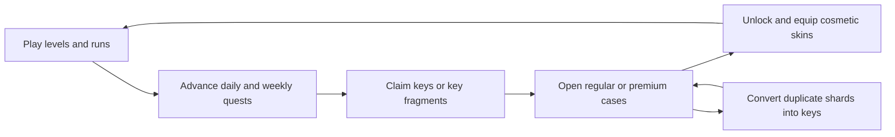

# Goblins of Greenglen — Game Design Document

> Living design baseline. This document describes the intended player experience, the currently implemented game, and the decisions still open for future development.

## Document Control

| Field | Value |
|---|---|
| Project | Goblins of Greenglen |
| Document version | 0.1 |
| Last updated | 2026-07-19 |
| Genre | 2D action-platformer with run-based and collection progression |
| Engine | Godot 4.6, GDScript only |
| Current state | Fully playable six-level release foundation; campaign framework and meta-progression implemented |
| Primary platform | Desktop PC, keyboard |
| Additional platforms | TBD |
| Game version | TBD; no `config/version` is currently defined in `project.godot` |

### Status labels

- **Implemented** — present and playable in the current project.
- **Planned** — supported by the active campaign roadmap, but not yet playable.
- **Candidate** — a direction worth prototyping; not yet approved as product scope.
- **TBD** — requires an explicit design decision.

### Purpose and source hierarchy

This GDD is the product-design baseline: it explains what the game should feel like, why its systems exist, and how future content should fit together. It is intentionally more stable and player-focused than an implementation checklist.

When documents disagree:

1. The running game and current code define **implemented behavior**.
2. This GDD defines **design intent and approved direction**.
3. `AGENTS.md` / `CLAUDE.md` define detailed technical constraints and architecture.
4. `README.md` is the public-facing feature summary.
5. `plan.md` contains completed campaign-map implementation prompts.
6. `Plan_todo.txt` is a design exploration, not approved shipped behavior.

Major changes should update the relevant status in this document and add an entry to the decision log.

---

## 1. High Concept

### Elevator pitch

**Goblins of Greenglen** is an approachable fantasy platformer in which a nimble knight bounds across floating paths, stomps mischievous goblins, gathers coins, and races toward the next red flag. Short, readable levels feed into replayable runs, local records, campaign mastery, quests, and a cosmetic collection.

### Player promise

The game should provide:

- movement that is easy to understand and satisfying to improve;
- combat that turns accurate platforming into a playful attack;
- compact levels with visible goals and little downtime;
- a clear reason to replay through score, time, map completion, quests, and cosmetics;
- a warm, whimsical medieval-fantasy identity rather than a grim or punishing one.

### Product identity

The game sits between a light arcade platformer and a compact progression game. The platforming must remain enjoyable without the meta systems. Quests, cases, skins, campaign milestones, and records should strengthen replayability, never conceal weak core play.

---

## 2. Design Pillars

### 2.1 Readable momentum

The player should spend most of a level moving, jumping, lining up stomps, or choosing a route. Hazards must be legible enough that failure feels attributable to a decision or execution error.

Design consequences:

- controls respond immediately;
- the double jump provides recovery and expressive routing;
- enemies patrol predictably;
- the red goal flag is visually distinct;
- important gameplay objects use strong silhouettes and contrasting colors;
- long transitions and non-interactive interruptions are kept brief.

### 2.2 Stomping is platforming

Combat is not a separate attack system. Position, descent, timing, and horizontal overlap are the attack. A successful stomp should feel precise but generous, with an immediate bounce, score feedback, sound, and a “POW!” flourish.

### 2.3 One more clean run

Runs are short enough to restart willingly and layered with independent goals: complete the route, improve Final Score, lower Run Time, finish quests, clear levels without damage, and perfect campaign regions.

### 2.4 Storybook Greenglen

The presentation combines bright, readable platforming with ornate, painterly fantasy framing. Wood, dark metal, gold trim, leaves, vines, shields, castles, keys, chests, mushrooms, and saturated rarity colors form the recognizable Greenglen visual language.

### 2.5 Progress is earned, not purchased

Gameplay and quest completion drive the cosmetic economy. Cases provide anticipation and collection goals, while duplicate protection through shards ensures that an unlucky reward still has value. There is no real-money economy in the current design.

### 2.6 Expand without invalidating the foundation

Stable region and level identities, controller boundaries, and separate save domains allow the game to grow. New regions and optional modes should reuse the strong core instead of silently changing what “Start Game” means.

---

## 3. Audience, Positioning, and Scope

### Target audience

- players who enjoy accessible 2D platformers and score chasing;
- players drawn to colorful medieval fantasy and collectible cosmetics;
- players who prefer short sessions and clear progress;
- younger or casual players who benefit from forgiving recovery, while still offering mastery goals for experienced players.

### Desired difficulty character

**Easy to enter, increasingly demanding, fair to master.** Early levels teach movement and stomp rules with low density. Later levels increase horizontal scale, enemy density, routing pressure, and variability without changing the player’s fundamental physics.

### Current product scope

- single-player;
- offline-first;
- desktop keyboard controls;
- six playable levels in one released campaign region;
- local saves and records;
- no networking, accounts, cloud saves, real-money purchases, or online leaderboard.

### Non-goals for the current foundation

- precision-platformer difficulty as the default experience;
- complex melee combos, weapons, or inventory statistics;
- multiplayer or competitive PvP;
- a dialogue-heavy narrative campaign;
- mandatory grinding to access the core six-level run;
- pay-to-win or purchasable power.

---

## 4. Player Fantasy, World, and Tone

### Current fantasy

The player is a heroic fantasy character crossing the lively realm of Greenglen, outmaneuvering goblins and claiming a path through dangerous locations. The fantasy is carried primarily through movement, visual identity, and playful confrontation rather than exposition.

### Tone

- adventurous;
- mischievous;
- triumphant;
- colorful and lightly comedic;
- never excessively violent or bleak.

Goblins should feel like troublesome, animated obstacles rather than horror creatures. Defeat feedback should be punchy and amusing. Success should feel celebratory without slowing the next attempt.

### Narrative status

The current game has a setting and conflict premise, but no finalized story canon. The following remain **TBD**:

- protagonist identity and motivation;
- why the goblins threaten Greenglen;
- the meaning of the flags and region journey;
- the role of the princess skins in the world;
- named regions, biomes, landmarks, allies, antagonists, and ending.

Future narrative work should not contradict the fast arcade structure. Story delivery should favor environmental details, map flavor, short introductions, and concise milestone moments.

---

## 5. Experience Structure

### 5.1 Moment-to-moment loop

1. Read nearby platforms, enemies, coins, and the next safe landing.
2. Move and jump toward the route.
3. Use the second jump to extend, correct, or redirect the approach.
4. Choose whether to avoid a goblin or convert the jump into a stomp.
5. Collect coins and seek efficient lines toward the flag.
6. Recover from a non-fatal mistake or restart after a failed run.

### 5.2 Run loop

1. Start a fresh run with three hearts, zero combat score, zero coins, and a fresh timer.
2. Complete levels by reaching their goal flags.
3. Carry score, coins, and active run time across level transitions.
4. Finish the route or lose all health.
5. Review Final Score and Run Time.
6. Run again, return to the main menu, or pursue another progression goal.

### 5.3 Campaign loop

1. Open the Map from the main menu.
2. Review region status, route connections, local records, and outstanding requirements.
3. Launch an unlocked location.
4. Complete it and unlock the next required location.
5. Complete all main locations and required core trials to clear the region.
6. Return for optional exploration and mastery content where available.

### 5.4 Meta-progression loop



This loop is cosmetic. Skins do not change movement, health, damage, score, or reward odds.

---

## 6. Game Modes and Entry Points

### 6.1 Classic Run — Implemented

The main-menu **Start Game** action begins the established linear six-level run at Location 1.

- Levels are played in order from 1 through 6.
- Completing Location 6 produces **Run Complete**.
- Losing all three hearts produces **Run Over**.
- Completed runs may set Best Score, Best Time, both, or neither.
- Failed runs are deliberately non-competitive and do not update either record.
- `R`, pause-menu **Try Again**, and result-menu **Run Again** start a clean run at Location 1.

This remains the default “whole game” challenge until an explicit mode strategy changes it.

### 6.2 Campaign Map — Implemented foundation

The main-menu **Map** action opens the campaign submenu.

- Players may inspect all planned regions.
- Only released and unlocked locations can launch gameplay.
- Starting at an unlocked Region 1 location continues through subsequent required main locations to the region endpoint.
- The mode does not return to the map after every individual level.
- It does not automatically cross into a successor region.
- Locked and unreleased locations remain visible for orientation and anticipation.
- The map remembers the last valid region and location selection.

### 6.3 Endless Challenge — Candidate

`Plan_todo.txt` describes an arcade survival concept that cycles the six templates with rising difficulty, persistent run health, larger arcade scoring, death-only finalization, and a future leaderboard-ready result object.

This concept should be treated as an **additional mode candidate**, not a replacement for Classic Run or Campaign, unless a later product decision explicitly says otherwise. A prototype should answer:

- Does cycling existing templates remain fun beyond two full cycles?
- Is persistent three-heart health too punishing without controlled recovery?
- Can endless scoring remain comparable when random spawns are involved?
- Do endless-compatible quests coexist cleanly with campaign quests?
- Is an online leaderboard worth its operational and anti-cheat cost?

No networking or online leaderboard is currently approved or implemented.

---

## 7. Controls and Player Movement

### 7.1 Current controls — Implemented

| Action | Input |
|---|---|
| Move left | Left Arrow / `A` |
| Move right | Right Arrow / `D` |
| Jump | Space / Up Arrow |
| Double jump | Press Jump again while airborne |
| Pause | Escape |
| Restart fresh run | `R` |

### 7.2 Movement values — Implemented baseline

| Property | Value |
|---|---:|
| Gravity | 1400 px/s² |
| Horizontal move speed | 220 px/s |
| First jump velocity | −520 px/s |
| Double-jump velocity | −460 px/s |
| Maximum jumps | 2 |

### 7.3 Movement design rules

- Horizontal movement should feel direct and predictable.
- The first jump provides the main arc; the second jump provides correction and route expression.
- Level geometry should be authored against the existing physics unless a deliberate global rebalance is approved.
- Required routes must never depend on random spawn arrangements.
- The player should be able to understand why a jump failed from the visible arc and landing point.
- Camera behavior must preserve forward visibility in scrolling levels and avoid revealing empty space beyond level bounds.

### 7.4 Input roadmap — TBD

- controller support;
- full key rebinding;
- input prompt switching;
- configurable hold/toggle behavior where relevant;
- touch controls or console certification.

---

## 8. Combat, Damage, and Recovery

### 8.1 Stomp combat — Implemented

A stomp is valid only when the player is descending and crosses the top of a living goblin from above with sufficient horizontal overlap.

| Property | Value |
|---|---:|
| Goblin patrol speed | 60 px/s |
| Stomp top tolerance | 2 px |
| Minimum horizontal stomp overlap | 4 px |

On a valid stomp:

- the goblin is defeated exactly once;
- combat score increases by 1;
- the player bounces using the double-jump velocity;
- both jumps become available again;
- stomp audio plays with light pitch variation;
- quest progress advances by one stomp;
- a “POW!” effect appears.

Upward contact, side contact, or an insufficient top overlap counts as a hit. The swept contact test accounts for both actors’ movement to reduce tunneling and frame-rate-dependent classifications.

### 8.2 Health and damage — Implemented

- A fresh level load begins with 3 hearts in the current Classic/Campaign model.
- Enemy damage removes one heart and subtracts 1 combat-score point.
- Falling removes one heart, subtracts 1 combat-score point, and respawns the player if health remains.
- A non-fatal hit or fall grants 1 second of invulnerability.
- New level loads intentionally have no spawn protection because spawn points are placed away from enemies.
- Reaching 0 hearts ends the run exactly once.

### 8.3 Fairness rules

- A dead or already rewarded enemy cannot damage the player or award a second stomp.
- Spawn points must not overlap enemy patrol areas.
- Enemy patrol must remain on its supporting platform.
- Invulnerability must be visually readable if future feedback is added. Current exact visual treatment is **TBD**.
- A fatal event must freeze the run before late callbacks can change the outcome.

---

## 9. Score, Coins, Time, and Records

### 9.1 Run resources — Implemented

| Resource | Rule | Purpose |
|---|---|---|
| Hearts | 3 at level load; −1 per hit or fall | Immediate survival margin |
| Combat Score | +1 per stomp; −1 per hit/fall | Rewards combat cleanliness |
| Coins | +1 per pickup; carried across the run | Route incentive and major Final Score input |
| Run Time | Active gameplay milliseconds only | Independent speed-performance measure |

### 9.2 Final Score — Implemented

```text
Final Score = max(0, Combat Score) + (Coins × 10)
```

Coins are intentionally more valuable than individual stomps in the final result. Combat Score and Coins remain separately visible during gameplay and separately recorded for campaign-level bests.

### 9.3 Run Time — Implemented

The timer counts only active gameplay. It does not count:

- main, map, pause, or result menus;
- paused gameplay;
- the one-second “Level Cleared!” transition delay.

Normal level changes retain elapsed time. Both completion and failure freeze the result time.

### 9.4 Local run records — Implemented

- **Best Score:** replaced only by a strictly higher Final Score.
- **Best Time:** replaced only by a lower positive time.
- The two records are independent.
- Only completed runs are submitted.
- A failed run never changes either record.
- Legacy score records without a timed completion remain valid and display “No best time yet.”

### 9.5 Campaign location records — Implemented

Each stable location can store its best local performance using that level’s score and coin deltas rather than the cumulative run values. Comparison priority is:

1. higher local score;
2. more local coins when scores tie.

### 9.6 Balance questions — TBD

- Whether combat score should remain ±1 when the game gains more enemy types.
- Whether Final Score needs a completion, no-damage, exploration, or time component.
- Whether coins should remain purely scoring objects or gain a separate spendable purpose.
- Whether campaign records should include time.

These should be solved through playtest data rather than by adding hidden complexity.

---

## 10. Run Outcomes and Lifecycle

### 10.1 Outcome states — Implemented

| State | Trigger | Presentation | Record policy |
|---|---|---|---|
| Active | Fresh run or level in progress | Gameplay HUD | No submission |
| Run Complete | Final required level reached | Gold-accent result | Submit score and time |
| Run Over | Health reaches zero | Warm red-orange result | Never submit |
| Abandoned | Restart, menu exit, or replacement | Clean reset/menu | Never submit |

### 10.2 Result presentation — Implemented

Both final outcomes use the same result hierarchy over the frozen final gameplay frame. The result shows:

- outcome title;
- Final Score;
- Run Time;
- saved Best Score and Best Time status;
- completion-only “New Highscore!” and/or “New Best Time!” messages;
- **Run Again** and **Main Menu** actions.

**Run Again** receives initial keyboard focus. Pause cannot open over a result.

### 10.3 Exactly-once rule

Result finalization, record submission, completion quests, and transitions must be idempotent. Repeated fatal contacts, repeated goal signals, stale delayed callbacks, or repeated input must not produce multiple rewards or load duplicate levels.

---

## 11. Campaign and World Map

### 11.1 Region roadmap

| Region | Main locations | Bonus locations | Release state | Current role |
|---|---:|---:|---|---|
| Region 1 | 6 | 0 | **Implemented / released** | Current playable campaign |
| Region 2 | 8 | 2 | **Planned / unreleased** | Visible topology preview |
| Region 3 | 10 | 0 | **Planned / unreleased** | Generic required-route placeholder |
| Region 4 | 12 | 0 | **Planned / unreleased** | Generic required-route placeholder |
| Region 5 | 14 | 0 | **Planned / unreleased** | Generic required-route placeholder |

The five regions form a sequential roadmap. Final names, biomes, narrative roles, scenes, trials, and art for Regions 2–5 are **TBD**. Placeholder names must not be mistaken for canon.

### 11.2 Connection language — Implemented

- **Required:** solid connection; advances the main route and region-clear requirement.
- **Optional:** dotted connection; bonus exploration and never required for `cleared`.
- **Locked/undiscovered:** dimmed visual state; does not change the semantic meaning of the line.

### 11.3 Region milestone model — Implemented foundation

- **Cleared:** all main locations and all core trials marked `required_for_clear`.
- **Explored:** Cleared plus all bonus locations.
- **Mastered:** all main and bonus locations plus all mastery trials.

Region 1 has no bonus locations or mastery trials, so its explored and mastered milestones follow its clear once all current requirements are met.

### 11.4 Region 1 gate — Implemented

Region 1 requires:

1. completion of all six main locations; and
2. **Flawless Finale:** complete Location 6 without taking damage during that Location 6 attempt.

The trial does not require an entirely damage-free six-level run. Its progress is capped and idempotent.

### 11.5 Region availability states — Implemented

| State | Meaning | Player action |
|---|---|---|
| Available | Region is released and unlocked | Select and play unlocked locations |
| Locked | Predecessor region requirements remain | Inspect dimmed topology and requirements |
| Coming Soon | Predecessor is cleared, but the region is unreleased | Inspect preview; cannot play |

An unreleased region remains non-playable even if its predecessor gate has been earned.

### 11.6 Future region rules

- Give every region a distinct mechanical identity, not only a new background.
- Teach one or two new ideas early, combine them later, and reserve mastery demands for optional paths or trials.
- Do not define fictional core trials before the region’s real mechanics exist.
- Do not release a region until every required location has a valid scene and reachable route.
- Keep stable IDs once save data can reference them.
- Optional branches should offer a meaningful variation: route challenge, collectible focus, unusual enemy mix, or mastery test.

---

## 12. Current Level Set

### 12.1 Content inventory — Implemented

| Location | Width | Goblins | Coins | Primary progression role |
|---|---:|---:|---:|---|
| 1 | 960 px default | 2 hand-placed | 5 hand-placed | Introduce movement, coins, stomps, and goal |
| 2 | 960 px default | 3 hand-placed | 5 hand-placed | Increase enemy interaction |
| 3 | 960 px default | 4 hand-placed | 5 hand-placed | Increase density and route pressure |
| 4 | 1920 px | 5 hand-placed | 8 hand-placed | Introduce horizontal scrolling and longer routing |
| 5 | 2560 px | 8 hand-placed | 10 hand-placed | Highest authored density and longest current route |
| 6 | 2200 px | 8 randomized | 10 randomized | Replayable finale and no-damage core trial |

The “primary progression role” column expresses the current design reading of the scenes and may be refined after formal playtesting.

### 12.2 Level construction rules

- Level scenes remain visually editable in Godot’s 2D editor.
- Required jumps must be tested with the current movement constants.
- `PlayerSpawn` must be safely separated from enemies and falls.
- The red goal flag must be reachable and visually clear.
- Coins should support route readability, encourage optional risk, or reward skilled arcs.
- Enemies should create timing and landing decisions rather than unavoidable damage.
- Scrolling stages must keep the player within configured camera bounds.
- The final route to a goal should not place an unavoidable enemy contact under the goal trigger.

### 12.3 Randomized spawn rules — Implemented for Location 6

- Only platforms in the `spawn_platforms` group participate.
- Start and goal platforms stay out of the spawn pool.
- Enemy patrol ranges are chosen within a safe range and constrained to platform bounds.
- Enemies use one per platform before cycling if more are requested.
- Multiple coins may share a platform.
- Enemy and coin vertical offsets match the authored scene convention.
- A retry creates a new arrangement; no seed is persisted.
- Randomization may alter tactical routing, but must not make the level impossible.

### 12.4 Future level-design template

For each new location, define:

| Field | Required note |
|---|---|
| Learning goal | What the player learns or proves |
| Signature element | New mechanic, arrangement, or visual landmark |
| Critical path | Required route and expected difficulty |
| Optional risk | Coins, bonus route, stomp chain, or shortcut |
| Enemy plan | Types, count, patrol logic, fairness constraints |
| Failure recovery | Safe landing, respawn expectations, readable hazards |
| Mastery hook | Time, score, no-damage, collection, or trial possibility |
| Validation | Completion, collision, focus, camera, and performance checks |

---

## 13. Quests and Reward Economy

### 13.1 Quest structure — Implemented

- 3 daily quest slots selected from a pool of 7.
- 2 weekly quest slots selected from a pool of 4.
- Daily quests reset by real calendar day.
- Claiming all three active daily quests immediately rolls a fresh daily set.
- Quest progress counts gameplay actions, not Final Score point values.

Current daily goals cover goblin stomps, coin collection, a no-damage goal, full-run completion, double jumps, and level clears. Current weekly goals cover completed runs, stomps, coins, and no-damage runs.

### 13.2 Keys and fragments — Implemented

- Keys are earned through claimed quests, not purchased with coins.
- The first 6 daily claims in a day grant one full key each.
- Further daily claims grant one key fragment.
- 3 key fragments automatically become 1 key.
- A claimed weekly quest grants 3 keys.

### 13.3 Cases — Implemented

| Case | Cost | Rare | Epic | Legendary |
|---|---:|---:|---:|---:|
| Regular | 1 key | 60% | 30% | 10% |
| Premium | 3 keys | 55% | 30% | 15% |

Case opening uses a decelerating reel and rarity-scaled reveal feedback. Premium cases improve the Legendary chance but are not guaranteed to outperform three Regular cases in every opening.

### 13.4 Duplicate protection — Implemented

- An already-owned skin awards 1 duplicate shard.
- 10 shards automatically convert to 1 key.
- Duplicate value is intentionally weaker than quest-fragment value so cases are a collection sink, not a self-sustaining farm.

### 13.5 Economy design rules

- The core game must remain playable with no interaction with cases.
- Cosmetics must never modify gameplay outcomes.
- Costs and odds must always be visible before spending keys.
- Random rewards must never consume real money under the current design.
- A player should always retain the Default Knight and starter skin.
- Save normalization must never remove legitimately owned cosmetics.
- Future skin additions should consider duplicate dilution and collection-completion pacing before launch.

---

## 14. Cosmetic Collection

### 14.1 Current collection — Implemented

| Tier | Skins | Drop behavior |
|---|---|---|
| Default | Default Knight | Always selectable; never drops; excluded from completion count |
| Starter | Sapphire Princess | Owned from the start; never drops |
| Rare | Gold Knight, Emerald Knight, Pink Knight | Regular and Premium cases |
| Epic | Blood Knight, Black Knight | Regular and Premium cases |
| Legendary | Golden Princess, Emerald Princess, Amethyst Princess, Ruby Princess | Regular and Premium cases |

There are 10 collectible skin variants across the starter and droppable tiers, plus the virtual Default Knight entry.

### 14.2 Skin design rules

- Every skin must have transparent source art.
- The character’s collision and movement remain unchanged.
- The silhouette must stay readable at the in-game target height.
- Rarity should be communicated through craftsmanship, color treatment, and reveal presentation—not gameplay power.
- New skins require a unique stable ID, display name, tier, texture, collection behavior, preview presentation, and save-compatibility check.
- Avoid adding low-value hue swaps that cannot be distinguished during normal play.

### 14.3 Collection UX — Implemented

The Skins menu uses a two-column layout:

- rarity-colored selectable list on the left;
- large character preview and status on the right;
- selection previews a skin;
- a separate action equips it;
- the equipped skin is applied on every level load.

---

## 15. UI and Information Architecture

### 15.1 Main navigation — Implemented

```text
Main Menu
├── Start Game
├── Map
├── Quests
├── Cases
├── Skins
└── Quit Game
```

The exact vertical arrangement may evolve, but **Start Game** remains the primary action and **Map** remains the campaign entry point.

### 15.2 Gameplay HUD — Implemented

The HUD communicates:

- current level/location context;
- hearts;
- combat score;
- coins;
- active Run Time;
- short transient messages;
- stomp feedback.

HUD information should remain readable over both bright sky and darker future backgrounds through pale text, dark outlines, spacing, and consistent anchoring.

### 15.3 Menu-state priority

Only one major interaction context should be active at a time:

1. result;
2. pause;
3. campaign or meta submenu;
4. main menu;
5. gameplay HUD.

Opening one context must hide incompatible contexts, clear stale gameplay when appropriate, and restore sensible keyboard focus.

### 15.4 Map UX — Implemented foundation

- one map shell, reused across regions;
- region selector as the primary region navigation;
- status banner in the header;
- visible solid required routes and dotted optional routes;
- selectable locked/unreleased nodes for inspection;
- disabled, silent Play action for anything unplayable;
- details panel for the selected location;
- remembered last selection;
- clean Back navigation to the main menu.

### 15.5 Accessibility and usability roadmap — TBD

Priority candidates:

- controller navigation and rebinding;
- separate music and SFX volume settings;
- reduced screen shake and reduced flash options;
- high-contrast and color-independent rarity indicators;
- scalable UI/text options beyond viewport stretch;
- visible invulnerability feedback;
- subtitles or text equivalents for meaningful audio cues;
- pause-on-focus-loss preference;
- localization-safe layouts;
- assisted mode options if playtests show repeated early-run abandonment.

Rarity, map status, and health must never rely on color alone.

---

## 16. Art Direction

### 16.1 Visual thesis

**A bright platforming storybook framed by a richly illustrated medieval-fantasy interface.** Gameplay prioritizes silhouette and spatial clarity; menus provide the ornate fantasy spectacle and collection atmosphere.

### 16.2 Existing visual language

- lush green valleys, forests, mountains, rivers, castles, ruins, and caves;
- painterly fantasy backdrops with atmospheric depth;
- crisp floating stone-and-grass platforms;
- saturated gold coins and a simple red flag for immediate readability;
- expressive green goblins and detailed knight/princess character art;
- dark wood panels framed by vines, roots, stone, and dark metal;
- gold keys, chests, crystals, mushrooms, shields, leaf crests, and warm lantern light;
- ornate six-to-one Greenglen buttons with separate normal, hover, pressed, and disabled states;
- Cinzel Bold for titles and Cinzel SemiBold for buttons/body UI;
- pale cream text with dark brown outlines.

### 16.3 Palette roles

| Role | Direction |
|---|---|
| World base | Sky blue, fresh green, pale cloud white, cool mountain blue |
| Structure | Gray stone, dark brown wood, blackened metal |
| Primary accent | Warm Greenglen gold |
| Nature accent | Leaf and emerald green |
| Failure accent | Restrained warm red-orange |
| Rare | Bright category color, currently item-specific |
| Epic | Stronger dramatic color treatment |
| Legendary | Gold-led premium treatment |
| Interactive disabled | Dimmed and desaturated, still legible |

Exact color tokens should live in the shared UI theme rather than being duplicated per menu.

### 16.4 Composition rules

- Reserve a calm visual area behind UI text and controls.
- Use ornate framing at screen edges and major menu anchors; avoid covering the core interaction area with decoration.
- Preserve a strong foreground/midground/background separation.
- Keep collectibles and hazards distinguishable from the backdrop at gameplay scale.
- Use gold primarily for reward, completion, legendary rarity, and primary emphasis.
- Keep failure warm and readable without turning the game’s overall tone grim.
- New menu backgrounds should belong to the same illustrated world and repeat the leaf-crest identity.

### 16.5 Character and object scale — Implemented

- Knight artwork targets 52 px in-game height.
- Goblin artwork targets 40 px in-game height.
- Platform artwork scales to its collision rectangle.
- Source images may be high resolution, but must remain clean and readable when reduced to gameplay scale.

### 16.6 Environment roadmap

Future regions should each define:

- biome and time/weather identity;
- foreground framing motifs;
- platform-material family;
- background depth layers;
- landmark or destination;
- enemy/collectible contrast plan;
- map-node and banner accent;
- transition relationship to the neighboring regions.

A future true multilayer parallax setup requires foreground art with transparent sky areas. Two opaque full-frame backgrounds must not be stacked and described as depth.

---

## 17. Audio Direction

### 17.1 Current identity — Implemented

Audio is playful generated chiptune: energetic, slightly goofy, and intentionally lighter than the richly painted menu art. It reinforces the arcade pace and keeps defeat from feeling harsh.

### 17.2 Current event set

- looping music;
- jump;
- double jump;
- coin;
- stomp;
- hit;
- death;
- level clear;
- win;
- UI click.

Coin, stomp, and jump sounds use slight pitch jitter to reduce repetition. Eight round-robin SFX voices allow overlapping effects.

### 17.3 Mixing rules — Implemented baseline

- Music and SFX use separate buses.
- The Music bus is set to −6 dB.
- Pause ducks music by a further 14 dB through the audio controller.
- Resume, restart, and returning to the main menu must always restore the normal music-player level.
- Run completion/failure stops gameplay music before the result presentation.

### 17.4 Future audio rules

- New region music should retain melodic chiptune continuity while reflecting biome identity.
- Essential events need unique, short, non-fatiguing cues.
- Rarity reveal audio should scale in excitement without masking the reward name.
- No single effect should dominate after bus routing and simultaneous playback.
- Volume sliders and mute controls are a priority usability addition.

---

## 18. Technical Design Constraints

This section captures constraints that affect design scope. Detailed architecture belongs in `AGENTS.md` / `CLAUDE.md`.

### 18.1 Technology

- Godot 4.6 standard build;
- pure GDScript, no C#;
- 960 × 540 internal viewport;
- 1280 × 720 default window override;
- `canvas_items` stretch mode;
- no external plugins or runtime dependencies.

### 18.2 Ownership boundaries — Implemented

- `Game.gd` owns run state, active stable IDs, level lifecycle, transitions, score, coins, health, timing, and outcomes.
- Explicit scene-tree controllers own audio, HUD, menus, quests, cases, skins, campaign map, campaign progress, and highscores.
- UI sends intent signals; it does not own competing gameplay state.
- `CampaignCatalog.gd` is the source of truth for region, location, trial, connection, scene-path, and map metadata.
- `Progression.gd` is the sole deliberate autoload because meta-progression must exist across scenes and menus.
- Player-to-game combat and movement events remain signal-based.

### 18.3 Design-facing invariants

- Stable IDs must not be renamed after release without migration.
- Unreleased content must never become playable merely because it is visible.
- Level-changing, menu, restart, and run-ending paths must invalidate delayed transitions.
- Gameplay rewards and saves must be exactly-once under duplicate signals.
- New menus must reuse the shared theme and established ownership model.
- Core gameplay must remain offline-capable.

---

## 19. Persistence and Player Data

### 19.1 Save domains — Implemented

| File | Schema | Owner | Data |
|---|---:|---|---|
| `user://highscore.cfg` | v3 | HighscoreStore | Best Final Score and Best Time |
| `user://progression.cfg` | v2 | Progression | Quests, keys, fragments, shards, cases, skins |
| `user://campaign.cfg` | v1 | CampaignProgressStore | Unlocks, completions, location records, trials, milestones, map selection |

All save domains use typed reads, normalization, schema metadata, backup-compatible writes, and `.bak` recovery through the shared save helper.

### 19.2 Save principles

- Corrupt or malformed values fall back safely.
- Older supported schema versions remain loadable.
- A load/normalization pass may reconcile newly released campaign content idempotently.
- Meta-progression survives run restarts and failures.
- Tests must never touch a player’s real save directory.
- The project-name migration from the former “Cloude Game” user directory remains one-time and non-destructive.

### 19.3 Online data — Candidate only

An online leaderboard would require a stable immutable run-result schema, unique run identity, versioning, validation, privacy decisions, server operations, and anti-cheat strategy. None of those should be implied by the current local record system.

---

## 20. Quality Bar and Validation

### 20.1 Current automated baseline

The repository documents 443 deterministic headless checks across save-system, campaign-progress, and smoke/behavior suites. The suite runs in isolated child processes and protects real save files with a canary.

Test counts must be updated only from actual final test output.

### 20.2 Feature definition of done

A player-facing feature is done when:

- the intended player outcome is documented;
- happy path, failure path, restart, menu exit, and duplicate-input behavior are defined;
- keyboard focus and 960 × 540 layout are verified;
- save compatibility is considered where state persists;
- automated regression coverage exists in the appropriate suite;
- parser/import and normal headless startup pass;
- visual and audio feedback are coherent with the existing style;
- public and technical documentation are synchronized.

### 20.3 Level definition of done

A level is done when:

- it loads from the catalog and is reachable through the intended flow;
- all required jumps are consistently possible;
- spawn, goal, collision, camera, fall, and retry behavior are correct;
- enemy patrols stay on valid surfaces;
- collectibles are reachable and purposeful;
- it can be completed with and without engaging optional risks;
- no-damage completion is possible if used by a trial;
- the art has no seams, opaque boxes, or unreadable overlaps;
- it has been playtested for first-clear and repeat-clear experience.

### 20.4 Playtest questions

Track observations rather than relying only on completion rate:

- Where do first-time players misunderstand stomp direction?
- Do players discover and intentionally use the double jump?
- Which coins feel like route guidance versus arbitrary pickup placement?
- Where does damage feel unavoidable?
- Do players understand Combat Score versus Final Score?
- Can players explain why failed runs do not set records?
- Can players distinguish Locked from Coming Soon on the map?
- Do quests motivate another run or distract from platforming?
- Are case costs and odds understood before opening?
- Does randomized Location 6 feel fresh or unfair?

Telemetry is not currently implemented. Playtest notes should avoid collecting unnecessary personal data.

---

## 21. Production Roadmap

### Phase A — Playable foundation — Implemented

- six complete levels;
- movement, double jump, stomp combat, health, coins, goal flow;
- Classic Run outcomes, Final Score, active Run Time, local records;
- pause, retry, main, result, quest, case, and skin menus;
- chiptune music/SFX and shared Greenglen UI;
- versioned and isolated saves;
- automated test harness.

### Phase B — Campaign foundation — Implemented

- stable five-region catalog roadmap;
- Region 1 playable through the public Map submenu;
- locked and Coming Soon preview states;
- required and optional route semantics;
- per-location completion and records;
- Region 1 Flawless Finale gate;
- Regions 2–5 protected as unreleased content.

### Phase C — Product polish — Recommended next

- formal playtest pass and balance notes for all six levels;
- settings menu with music/SFX controls;
- controller support and input rebinding;
- accessibility options for flash, shake, contrast, and text;
- version string and release-build conventions;
- refresh screenshots and public media after UI milestones;
- define target platforms and minimum performance requirements.

### Phase D — Region 2 pre-production — Planned, content TBD

- approve biome, story role, mechanical identity, and visual palette;
- replace 8 main and 2 bonus placeholders with named designs;
- define core and mastery trials from actual mechanics;
- create level blockouts before final art;
- validate save reconciliation and Region 1 gate messaging;
- release only when every required location is complete and tested.

### Phase E — Additional modes — Candidate

- prototype Endless Challenge as a separate entry point;
- evaluate template repetition, score model, health persistence, scaling cap, and quest compatibility;
- decide whether local survival records are sufficient;
- consider online leaderboard scope only after a fun, deterministic local mode exists.

### Phase F — Regions 3–5 — Planned framework, content TBD

Proceed one region at a time. Placeholder counts of 10, 12, and 14 describe the current roadmap capacity, not an obligation to create filler. Revisit counts if playtesting or production capacity shows a smaller, stronger region is better.

---

## 22. Key Risks and Mitigations

| Risk | Why it matters | Mitigation |
|---|---|---|
| Core and meta loops compete | Cases/quests can overshadow platforming | Keep rewards cosmetic and playtest menu-to-game return rate |
| Art-style drift | Detailed menu art and simpler gameplay art may feel disconnected | Reuse palette, motifs, type, outlines, and a shared art brief |
| Random finale feels unfair | A core trial depends on Location 6 | Constrain spawns, preserve safe routes, test many seeded layouts |
| Campaign scope grows too large | The roadmap currently implies 50 main locations | Gate production region by region; prioritize distinctive mechanics over count |
| Placeholder names become accidental canon | Generic labels can leak into release | Require a content/naming pass before any future region ships |
| Record rules confuse players | Score and time are independent; failures are excluded | Explain policy in results and keep labels consistent |
| Economy fatigue | Duplicate rewards may feel unrewarding | Monitor collection pacing; keep shards transparent; avoid bloating pools |
| Save regression | Multiple persistent systems are player-sensitive | Maintain schemas, backups, normalization, isolated tests, and stable IDs |
| Endless concept conflicts with campaign | A replacement would invalidate current completion semantics | Prototype it as a distinct mode and record a formal product decision |
| Accessibility debt | Flash, shake, ornate text, and color states may exclude players | Prioritize settings and redundant non-color communication before content scale-up |

---

## 23. Open Design Decisions

These questions should be answered deliberately before related production begins:

1. What is the protagonist’s canonical identity and goal?
2. Is Region 1’s current generic naming temporary for all six locations?
3. What are the final themes and mechanical identities of Regions 2–5?
4. Should Region 2 keep exactly 8 main and 2 bonus locations after blockout?
5. Should Classic Run always remain a six-level gauntlet as new regions ship?
6. Should campaign runs have region-specific results or reuse the generic Run Complete screen indefinitely?
7. Should an unlocked location launch the remaining region route or offer a true single-level replay mode?
8. Should Combat Score remain a small modifier next to coin-heavy Final Score?
9. Do campaign location records need a time component?
10. Should coins remain score-only, or become a separate non-premium currency?
11. What accessibility options are required for the first public release target?
12. Which controllers and platforms are officially supported?
13. Is Endless Challenge approved as a separate mode, rejected, or deferred?
14. If Endless is approved, does it use fixed seeds for competitive comparability?
15. Is any online leaderboard worth the moderation, privacy, hosting, and anti-cheat obligations?
16. What is the release and versioning strategy for saves and run results?

---

## 24. Content Brief Templates

### 24.1 Region brief

```text
Region ID:
Working title:
Release state:
Narrative purpose:
Player-facing fantasy:
Biome and landmark:
Primary palette:
Signature mechanic(s):
Main location count:
Bonus location count:
Required core trial(s):
Optional mastery trial(s):
New enemy/object needs:
Music direction:
Map presentation:
Difficulty entry/exit targets:
Dependencies and risks:
```

### 24.2 Level brief

```text
Stable level ID:
Display name:
Region / route type:
Learning or mastery goal:
Start-state promise:
Critical path beats:
Optional risk/reward:
Enemy plan:
Coin plan:
Camera / width:
Spawn and checkpoint rules:
Goal presentation:
No-damage feasibility:
Art and audio landmarks:
Playtest questions:
Completion criteria:
```

### 24.3 Feature brief

```text
Player problem:
Desired player outcome:
In scope:
Out of scope:
Entry and exit points:
Rules and edge cases:
UI / focus states:
Audio / visual feedback:
Persistence impact:
Compatibility impact:
Test plan:
Success criteria:
Open decisions:
```

---

## 25. Decision Log

| Date | Decision | Status / rationale |
|---|---|---|
| 2026-07-19 | Treat the current six-level completion flow as the shipped Classic Run | Matches the running game, current documentation, results, quests, and record policy |
| 2026-07-19 | Treat the five-region catalog as the active campaign roadmap | Region 1 is released; Regions 2–5 remain visible, safe previews |
| 2026-07-19 | Treat the endless survival proposal as a separate mode candidate | Avoids silently replacing campaign completion and invalidating existing systems |
| 2026-07-19 | Keep current progression cosmetic and offline-first | Preserves fair platforming and avoids monetization/network dependencies |

---

## 26. Revision Checklist

When expanding this document:

- mark every new item Implemented, Planned, Candidate, or TBD;
- distinguish player-facing rules from technical implementation notes;
- update tables and formulas when balance values change;
- record decisions that resolve an open question;
- keep placeholder content visibly labeled;
- synchronize implemented behavior with `README.md` and technical constraints with `AGENTS.md` / `CLAUDE.md`;
- verify test totals from actual output rather than copying stale documentation;
- avoid describing prototypes or future online features as shipped.
